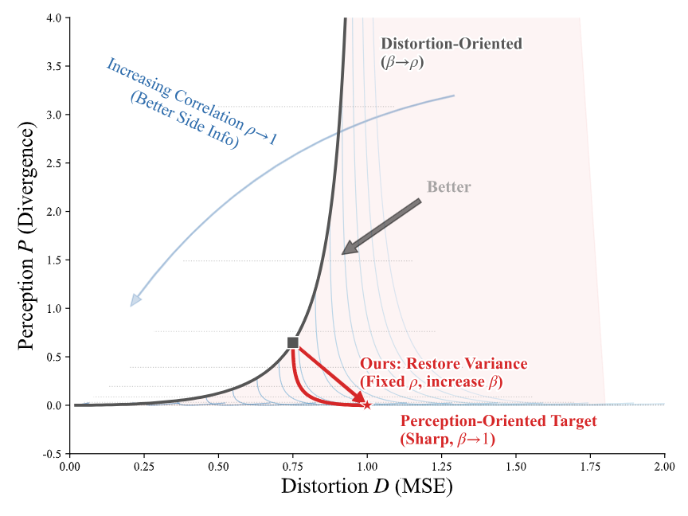
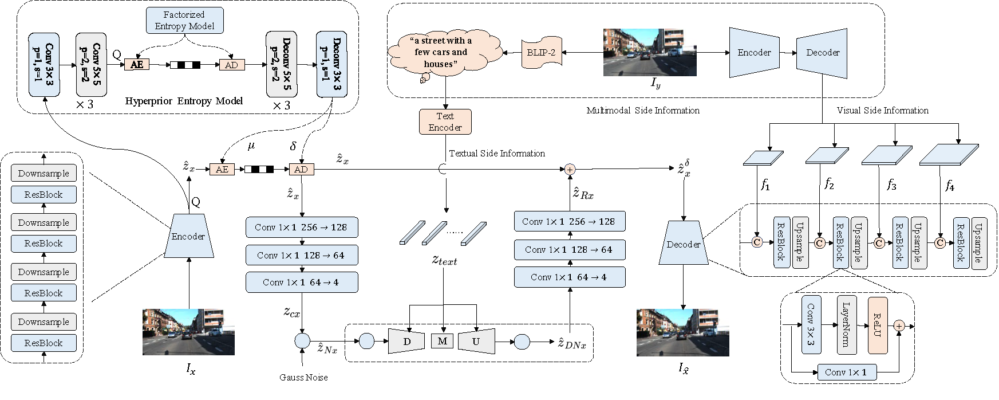
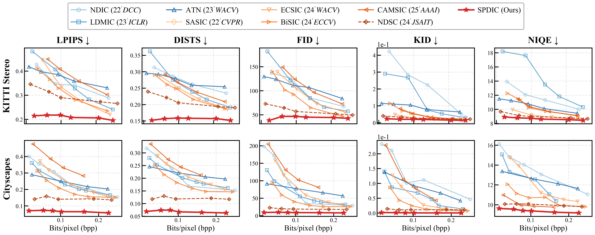

# Perceptual Distributed Image Compression: Only Need Stochasticity

<!-- [](https://arxiv.org/abs/24XX.XXXXX) -->
[](https://mommqq.github.io/SPDIC-Demo)
[](LICENSE)
[](https://pytorch.org/)

This repository contains the official implementation of the paper: **"Perceptual Distributed Image Compression: Only Need Stochasticity"**.

> **Abstract:** Distributed image compression (DIC) offers significant efficiency gains for bandwidth-constrained and collaborative environments, particularly in extremely low-bitrate scenarios ($<$ 0.1 bpp). However, most existing DIC methods adhere to a distortion-oriented paradigm, prioritizing pixel-wise fidelity at the cost of localized blurring and textural loss. By modeling local image patches as Gaussian distributions, this paper presents a theoretical analysis of the statistical characteristics of the reconstruction. Our derivation reveals two critical insights: (1) the perception-distortion (P-D) trade-off is fundamentally governed by the variance of the reconstructed signal, implying that injecting appropriate stochasticity is necessary to restore intrinsic variance; and (2) maximizing the available correlation via effective side information utilization is indispensable for perceptual reconstruction in DIC. Guided by the insights, we propose SPDIC, a novel perceptual DIC framework that introduces controlled stochasticity at the decoder to restore intrinsic variance. To maximize the available correlation, we encode the correlated image into multimodal side information. The decoding process utilizes a pre-trained latent diffusion model guided by textual side information to initially reduce noise accumulation, while multi-level visual side information is subsequently applied to align structural details. Extensive experiments on KITTI Stereo and Cityscapes datasets reveal that SPDIC significantly outperforms existing methods in perceptual quality. 

---

## 🌟 Key Features

*   **Theory-Driven Design:** Based on a formal derivation of the P-D trade-off in DIC under Gaussian assumptions. We identify that blurring stems from variance loss ($\beta < 1$) in conditional mean estimation.
*   **Stochastic Decoding:** Unlike deterministic decoders, SPDIC utilizes a pre-trained **Latent Diffusion Model (LDM)** to inject controlled stochasticity, restoring intrinsic variance and recovering realistic textures.
*   **Multimodal Side Information:**
    *   **Textual SI:** Extracted via BLIP-2 & CLIP to provide global semantic guidance and reduce noise uncertainty.
    *   **Visual SI:** Extracted via CNN to impose spatial constraints and maximize structural correlation ($\rho$).
*   **SOTA Perceptual Quality:** Achieves state-of-the-art LPIPS, FID, DISTS, KID and NIQE scores, particularly at extremely low bitrates.

---

## 📊 Theoretical Insight

Our analysis reveals that distortion-oriented methods (solid gray curve) suppress variance ($\beta \to \rho$) to minimize MSE, leading to **regression to the mean** (blurring). **SPDIC** (red arrow) explicitly restores variance ($\beta \to 1$) via stochasticity to approach the perfect perception point.

<p align="center">
  <!-- Please convert pdf to png/jpg for GitHub display -->
  
  <br>
  <!-- <em>Figure 1: Theoretical analysis of the P-D trade-off in DIC. Enhancing correlation ($\rho$) shifts the boundary, while restoring variance ($\beta$) moves along the curve towards better perception.</em> -->
</p>

---

## 🏗️ Architecture

SPDIC consists of a standard encoder for the target image and a novel stochastic decoder. The decoder is guided by multimodal side information from the correlated image available at the receiver.

<p align="center">
  
  <br>
  <!-- <em>Figure 2: Overview of the proposed SPDIC framework.</em> -->
</p>

---

## 🛠️ Installation

1.  **Clone the repository:**
    ```bash
    git clone https://github.com/Mommqq/SPDIC.git
    cd SPDIC
    ```

2.  **Create environment:**
    ```bash
    conda create -n spdic python=3.9
    conda activate spdic
    ```

3.  **Install dependencies:**
    ```bash
    pip install -r requirements.txt
    ```
    *Key libraries: `torch`, `diffusers`, `transformers`, `compressai`, `lpips`, `open_clip_torch`.*

---

## 📂 Data Preparation

We evaluate our model on **KITTI Stereo** and **Cityscapes** datasets.

*   **KITTI Stereo:**
    *   Download from [KITTI 2012](https://www.cvlibs.net/download.php?file=data_stereo_flow_multiview.zip) and [KITTI 2015](https://www.cvlibs.net/download.php?file=data_scene_flow_multiview.zip).
    *   **Preprocessing:** Center-crop to $370 \times 740$ and downsample to $128 \times 256$.
*   **Cityscapes:**
    *   Download from [Cityscapes](https://www.cityscapes-dataset.com).
    *   **Preprocessing:** Resize to $128 \times 256$.

---

## 📊 Quantitative Comparison
SPDIC demonstrates superior perceptual metrics compared to baselines like ATN, LDMIC, and CAMSIC, particularly in the extremely low-bitrate regime.
<p align="center">

<br>
<!-- <em>Figure 3: Quantitative comparison of perceptual metrics on KITTI and Cityscapes.</em> -->
</p>


## 🚀 Usage

### Training and evaluation
To train and evaluation SPDIC with config:

```bash
python train.py 
```

---

## 🙏 Acknowledgement

We thank the authors of the following open-source projects, which were helpful to our work:
*   [CompressAI](https://github.com/InterDigitalInc/CompressAI)
*   [Diffusers](https://github.com/huggingface/diffusers)
*   [CDC](https://github.com/buggyyang/CDC_compression)
