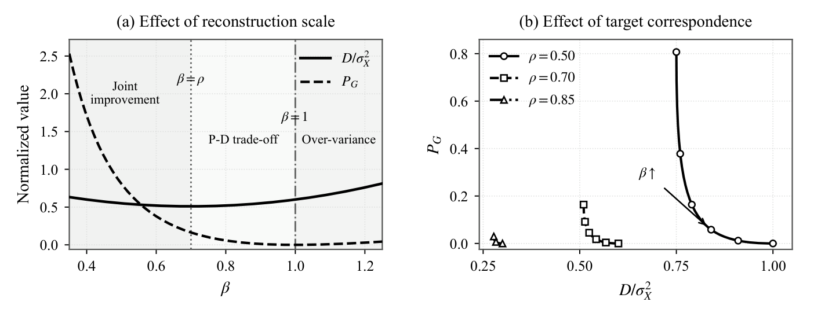
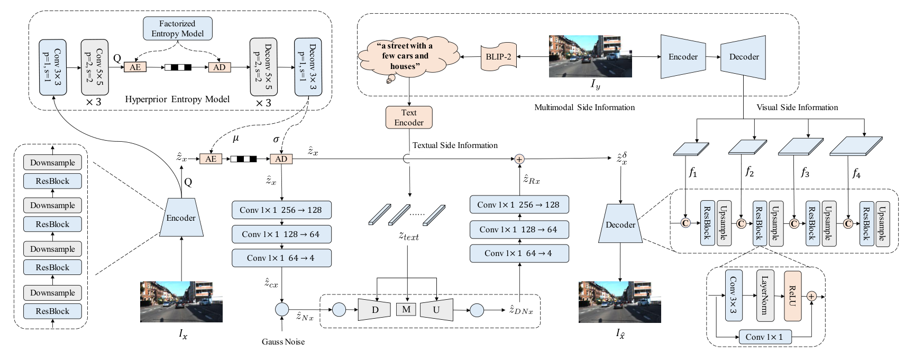
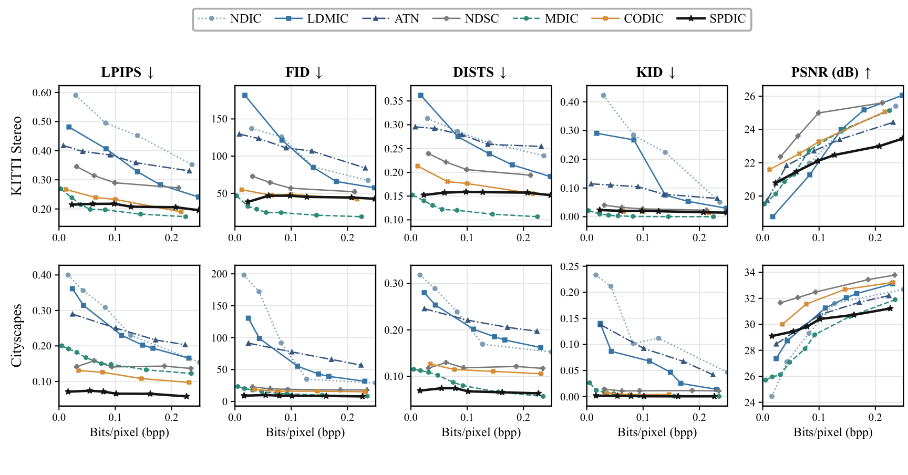
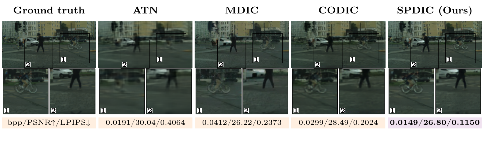

# SPDIC

**Perceptual Distributed Image Compression via Controlled Stochastic Reconstruction**  
Guojun Xu, Jianwen Xiang, Yaning Xie, and Junwei Zhou  
Wuhan University of Technology

[Project page](https://mommqq.github.io/SPDIC-Demo/)

SPDIC addresses distributed image compression when a correlated image is available at the decoder but not at the target encoder. It combines stochastic refinement of the compressed latent with textual and visual side information at the decoder.

The analysis relates reconstruction scale to target correspondence through a local Gaussian model. The quantity $P_G$ in that analysis measures a discrepancy between local Gaussian marginals; it is distinct from LPIPS.

Experiments use KITTI Stereo and Cityscapes. The quantitative plots report LPIPS, FID, DISTS, KID, and NIQE against bitrate. The reconstruction figure shows a Cityscapes example.

## Source code

The SPDIC model and training code are in `modules/` and `train.py`.
